# HDR Simple Framework

Simple image processing framework. Realtime HDR. HDR tonemapper.

## Examples

#### 1
| EV- | EV0 | EV+ |
| --- | --- | --- |
| 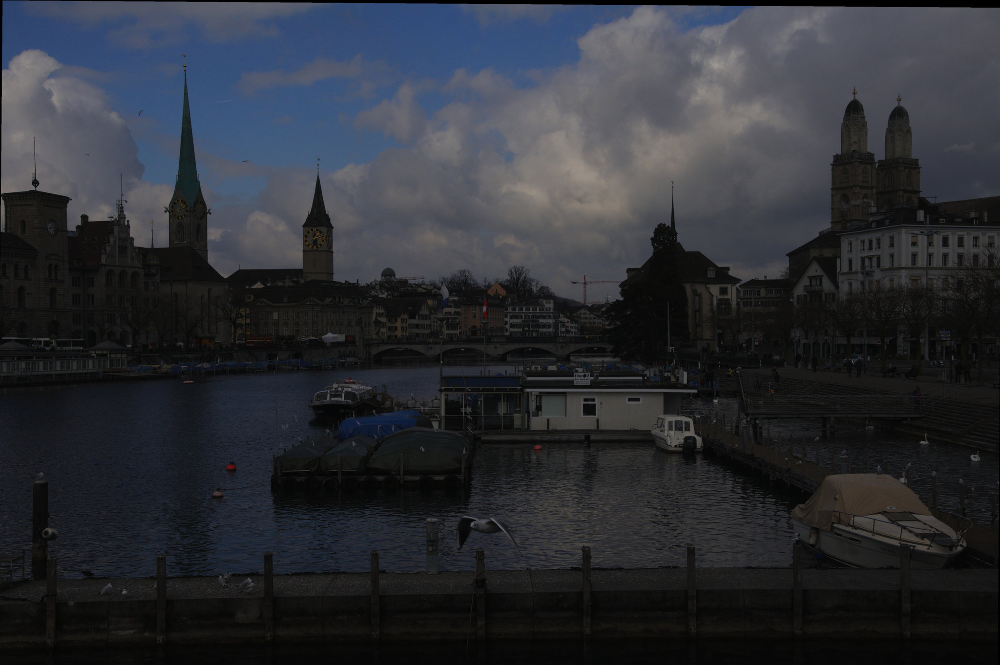 | 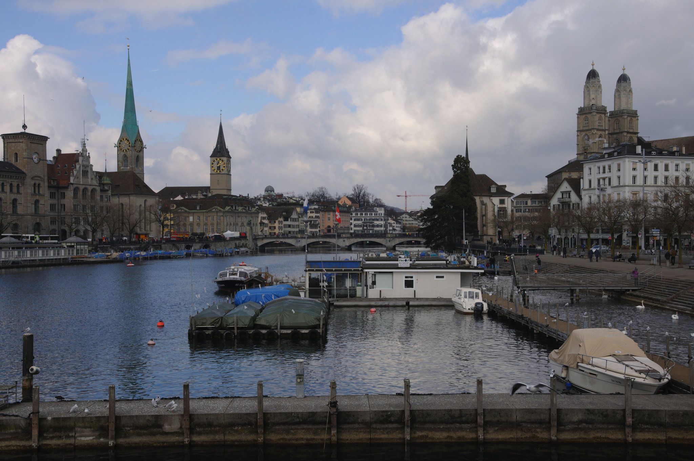 | 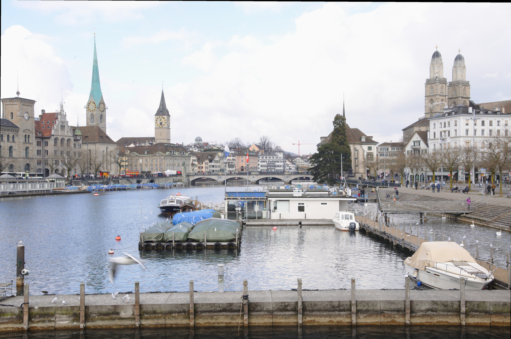 |

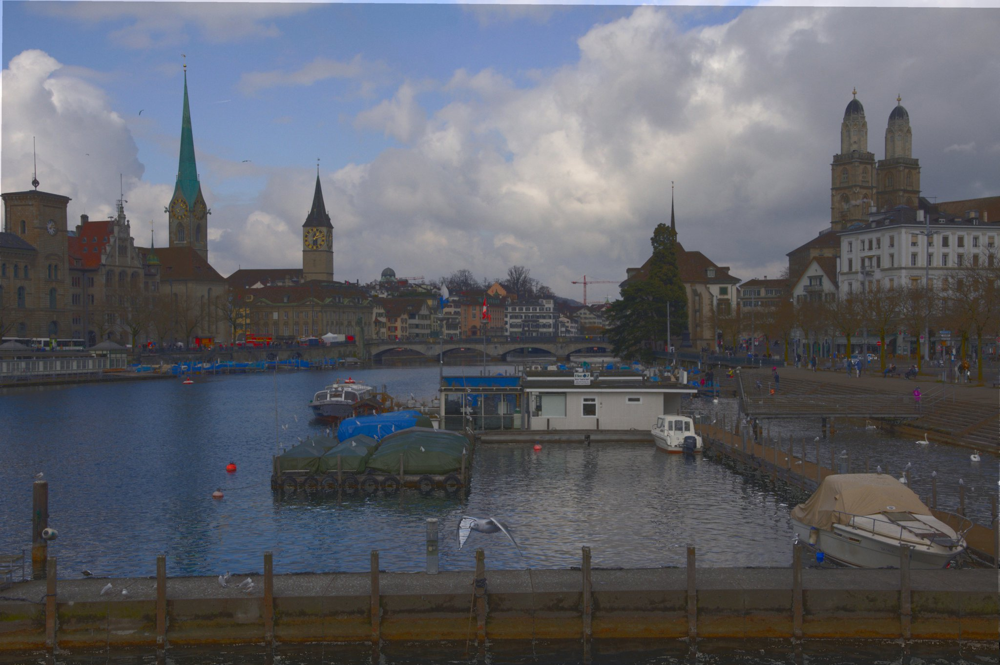

#### 2

| EV- | EV0 | EV+ |
| --- | --- | --- |
| 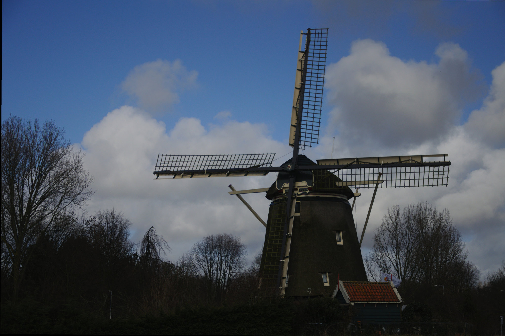 | 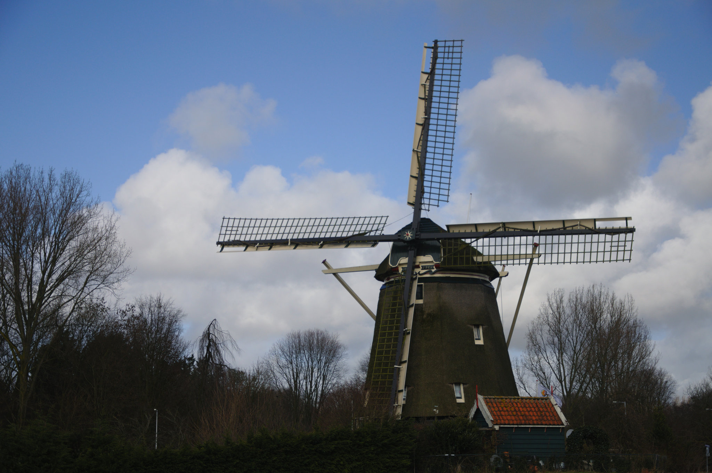 | 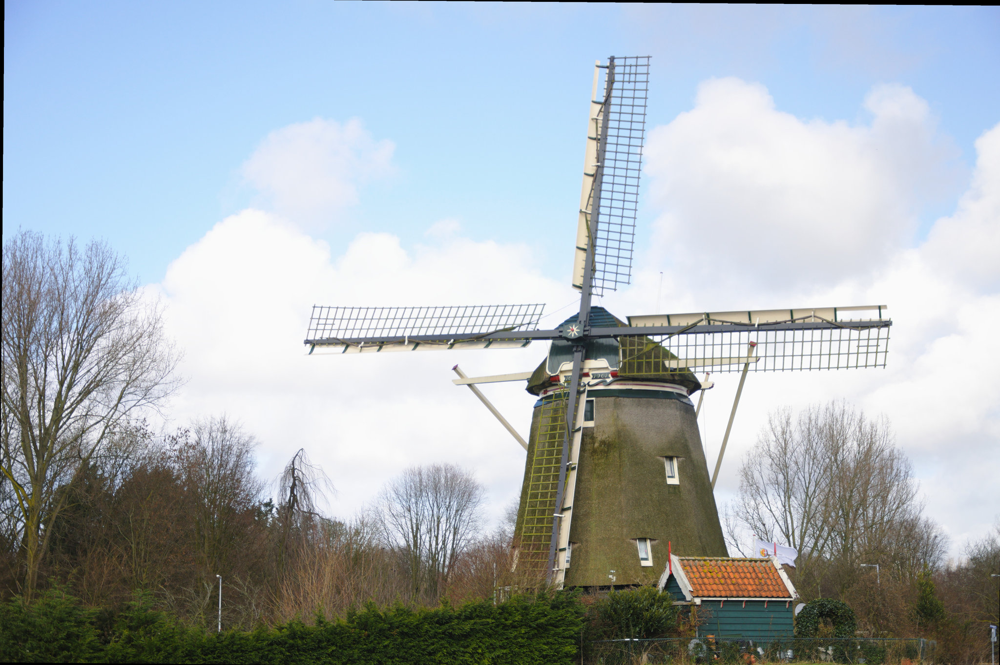 |

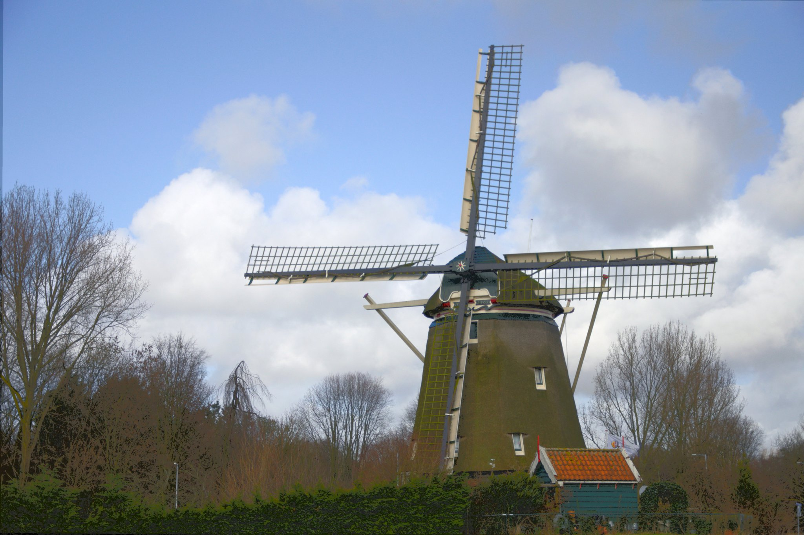

#### 3

| EV- | EV+ |
| --- | --- |
| 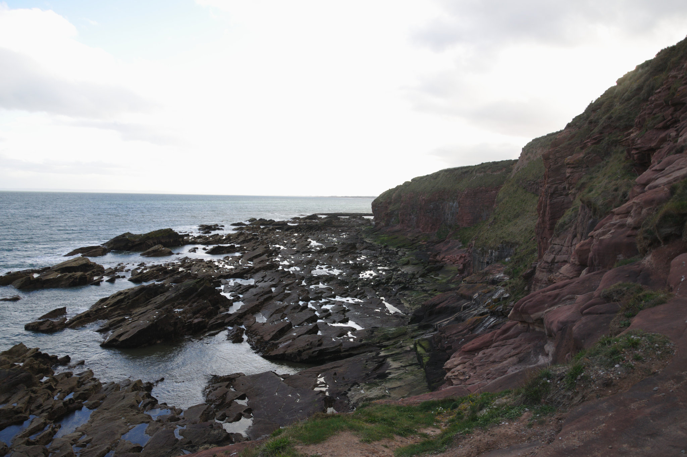 |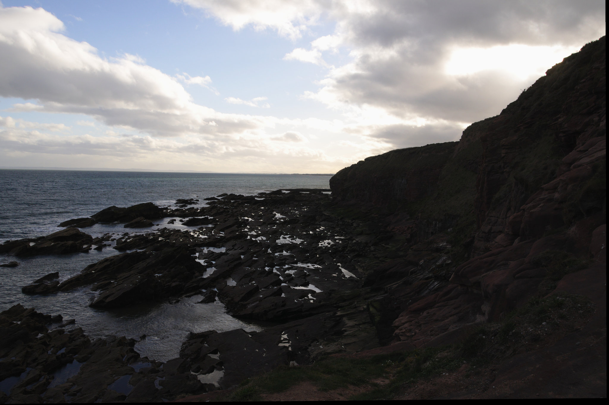 |

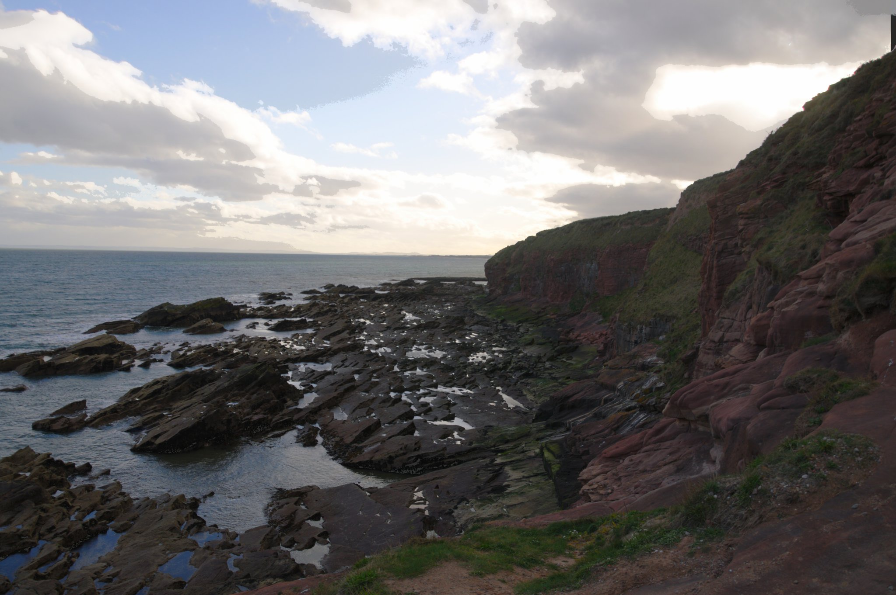

#### 4

| EV-  | EV+ |
| ---  | --- |
| 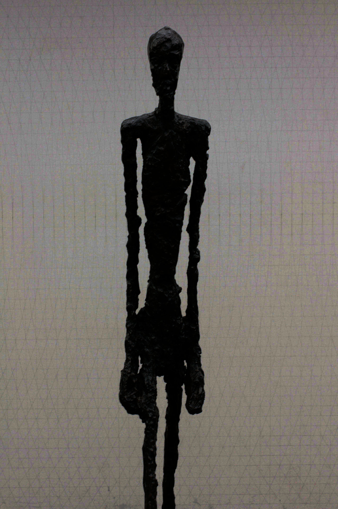 | 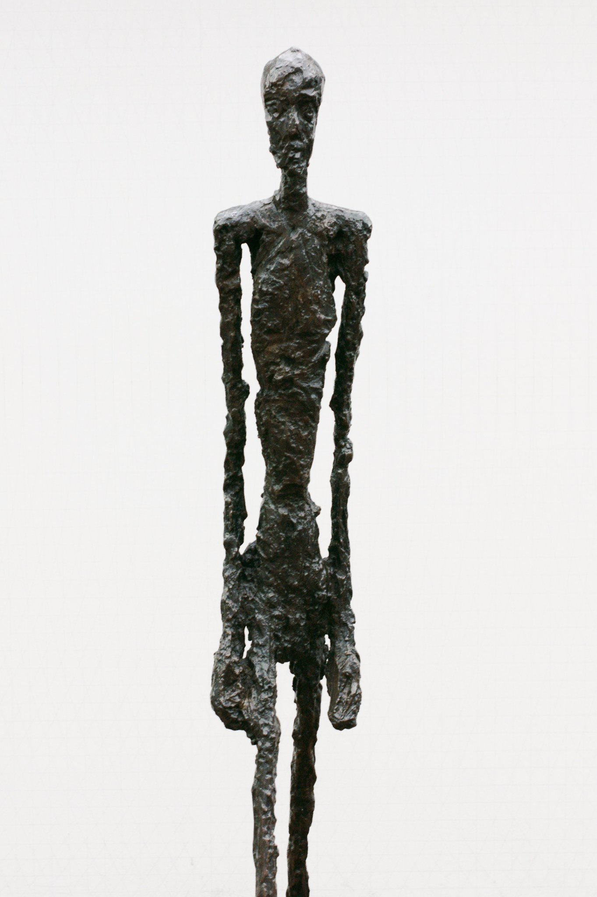 |

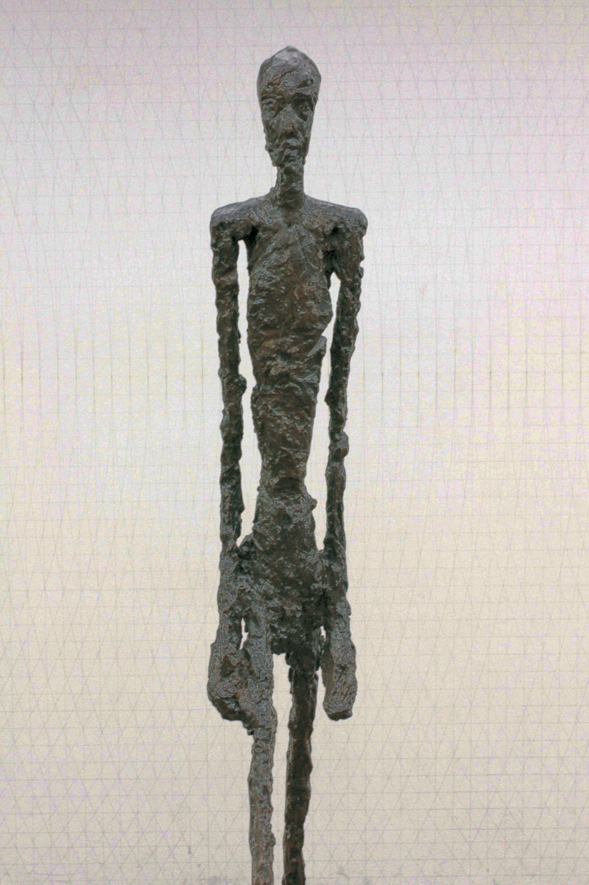

## Build
Build with CMake.

Requirements:
 * OpenCV
 * LibRaw
 * C++ Boost
 * Google Test
 * evif2

